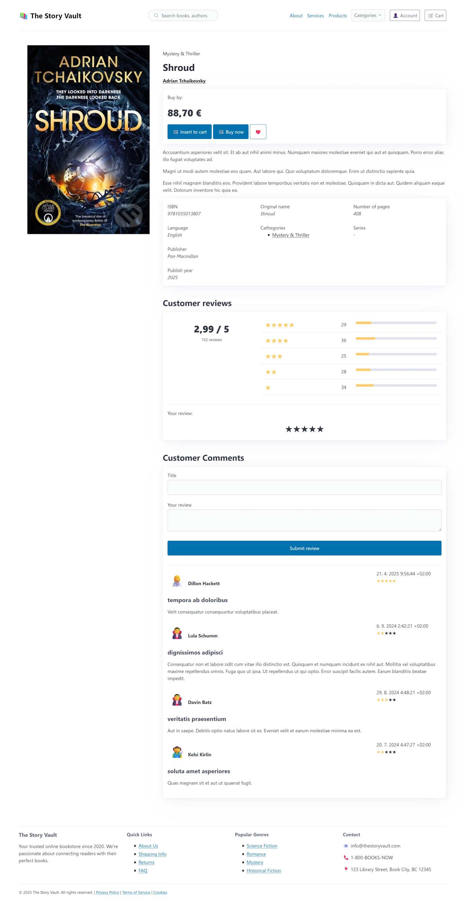
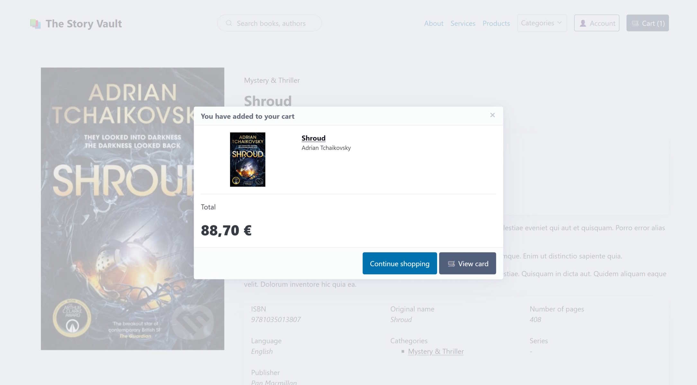
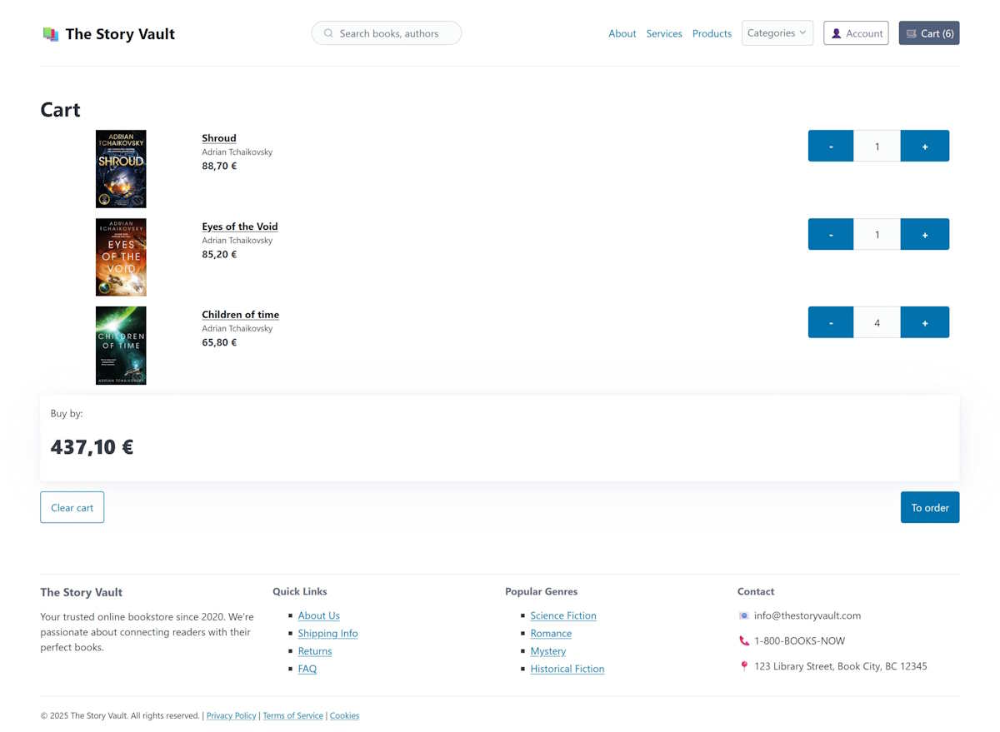

# eShop on HTMX
An eShop demonstration of a shop selling books built on ASP.NET Core, Blazor components and HTMX.

This project tests the capabilities of HTMX on a non-trivial task where SPA frameworks are commonly used.
I went to the extreme and tried not to use JavaScript, so even the modal windows are closed by the server call.

Some components are lazy to load because they have a separate cache. Others, to save performance (comments for a book), are loaded only when the user scrolls to them.

## Get started
1. Install [.Net 9 SDK](https://dotnet.microsoft.com/en-us/download/dotnet/9.0)
1. Build using `dotnet build`
1. Configure connection string and database type in _appsettings.json_ (MsSql, Sqlite or MariaDb)
1. Create database with data using `dotnet run -- --migrate`
1. Run project using `dotnet run`

## Technologies
- [.NET 9.0](https://dotnet.microsoft.com/en-us/download/dotnet/9.0)
- [ASP.NET Minimal API](https://learn.microsoft.com/en-us/aspnet/core/fundamentals/minimal-apis?view=aspnetcore-9.0)
- [Blazor Components](https://learn.microsoft.com/en-us/aspnet/core/blazor/?view=aspnetcore-9.0) - for reusable UI components
- [HTMX](https://htmx.org/) - for dynamic HTML updates
- [PicoCSS](https://picocss.com/) - a lightweight CSS framework for semantic HTML
- CSS isolation for components
- [CaseR](https://github.com/harrison314/CaseR) - Use case implementation library and separate cross-cutting concerns.
- [Entity Framework Core](https://learn.microsoft.com/en-us/ef/core/) - with _SQLite_ (default), _MariaDb_ or _MS SQL Server_ for data access
- Only 13 lines of JavaScript code in the whole project! (JavaScript is used only for antiforgery token propagation)

## Screenshots

*Home page*

*Book details page*

*Insert book to cart dialog*

*Author details page*

*Cart page*

## Motivation for using HTMX

## Additional resources
1. <https://www.bensampica.com/post/minimalapihtmx/>
1. <https://khalidabuhakmeh.com/update-html-elements-with-htmx-triggers-and-aspnet-core>
1. <https://khalidabuhakmeh.com/server-sent-events-in-aspnet-core-and-dotnet-10>
1. <https://khalidabuhakmeh.com/alpinejs-polling-aspnet-core-apis-for-updates>
