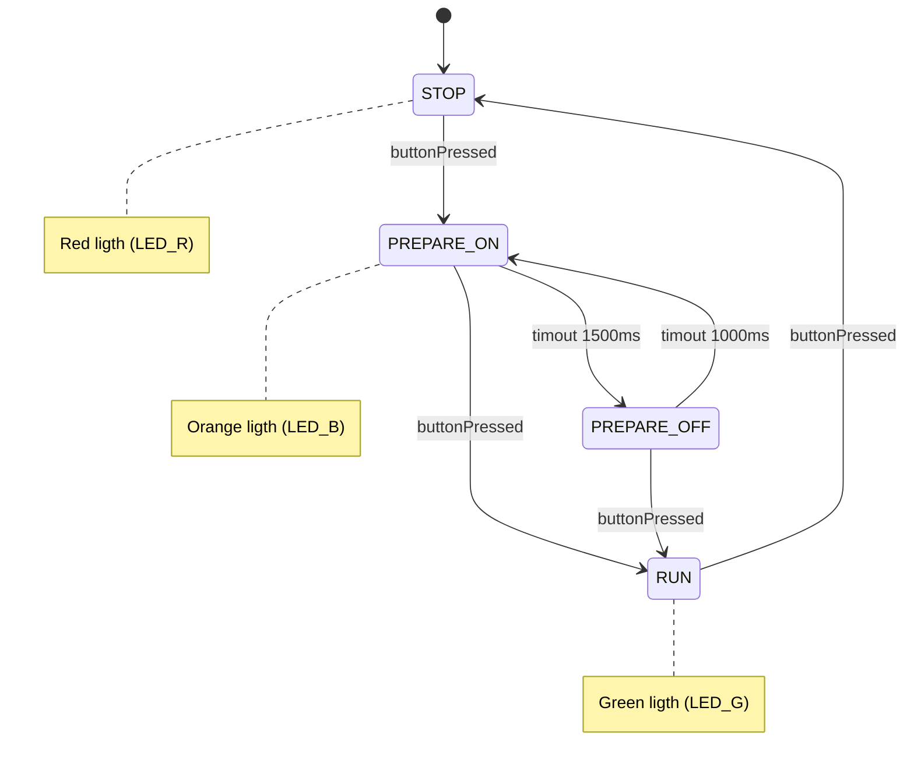

# State builder for Arduino framework
This example shows a simple library that can be used to model a state machine and directly convert a UML state diagram into code in the Arduino framework.

This example models something like a traffic light, whose state diagram is shown in the following example:



Example C doe:

```c
SM_DEFINE_STATE(STOP);
SM_DEFINE_STATE(PREPARE_ON);
SM_DEFINE_STATE(PREPARE_OFF);
SM_DEFINE_STATE(RUN);

SM_DECLARE_FUNCTION(runMachine);

SM_state_t arduinoState;

void setup()
{
  pinMode(LED_R, OUTPUT);
  pinMode(LED_G, OUTPUT);
  pinMode(LED_B, OUTPUT);
  pinMode(GPIO_BTN, INPUT_PULLUP);

  Serial.begin(9600);

  SM_INIT(&arduinoState, STOP);
}

void loop()
{
  runMachine(&arduinoState);
}


SM_DEFINE_FUNCTION_BEGIN(runMachine)
  SM_STATE_BEGIN(STOP, stopAction)
    SM_TRASITION(buttonPressed, PREPARE_ON)
  SM_STATE_END()

  SM_STATE_BEGIN(PREPARE_ON, prepareOnAction)
    SM_TRASITION(buttonPressed, RUN)
    SM_TRASITION_INLINE(smTimerElapsed(&timer1, 1500), PREPARE_OFF)
  SM_STATE_END()

  SM_STATE_BEGIN(PREPARE_OFF, prepareOnAction)
    SM_TRASITION(buttonPressed, RUN)
    SM_TRASITION_INLINE(smTimerElapsed(&timer2, 1000), PREPARE_ON)
  SM_STATE_END()

  SM_STATE_BEGIN(RUN, runAction)
    SM_TRASITION(buttonPressed, STOP)
  SM_STATE_END()
SM_DEFINE_FUNCTION_END()
```